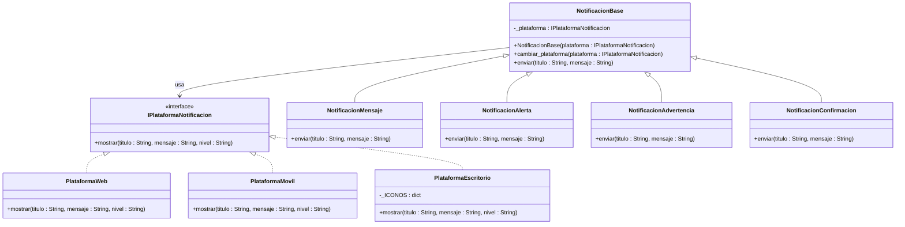

# Escenario 2 — Bridge

Aplicación que gestiona la visualización de notificaciones en diferentes plataformas (por ejemplo: escritorio, móvil web).

### Típo de patrón: **Patrón Estructural**

El escenario indica un problema de acoplamiento entre dos dimensiones (tipos de notificación y plataformas de implementación) que evolucionan independientemente.

### Patrón a utilizar: **Bridge (Patrón Puente)**

El patrón Bridge es ideal debido a que permite separar la abstracción de su implementación para que ambas puedan variar de forma independiente.

✅ Separación de responsabilidades El patrón Bridge separa: la lógica de la notificación y el medio. Las clases de notificaciones definen el tipo, mientras que las plataformas donde se presenta, lo que segrega las responsabilidades y facilita mantenimiento.

✅ Escalabilidad El patrón permite agregar nuevas plataformas o nuevos tipos de notificación de forma independiente sin modificar el resto del sistema, haciendolo extensible,mantenible.

✅ Flexibilidad El Builder permite agregar únicamente las configuraciones necesarias sin crear múltiples constructores o subclases.

✅ Reducción de clases El patrón evita esta explosión combinatoria, ya que, cualquier notificación puede trabajar con cualquier plataforma, reutilizando las mismas clases.

✅ Flexibilidad en tiempo de ejecución La plataforma puede cambiar dinámicamente mientras en tiempo de ejecucion y permite la adaptación a diferentes entornos de ejecución.

### Diagrama de Clases:



### Ejecución del escenario:

```cmd
python -m ejercicio2_bridge.main
```

---

[← Volver al inicio](../README.md)
