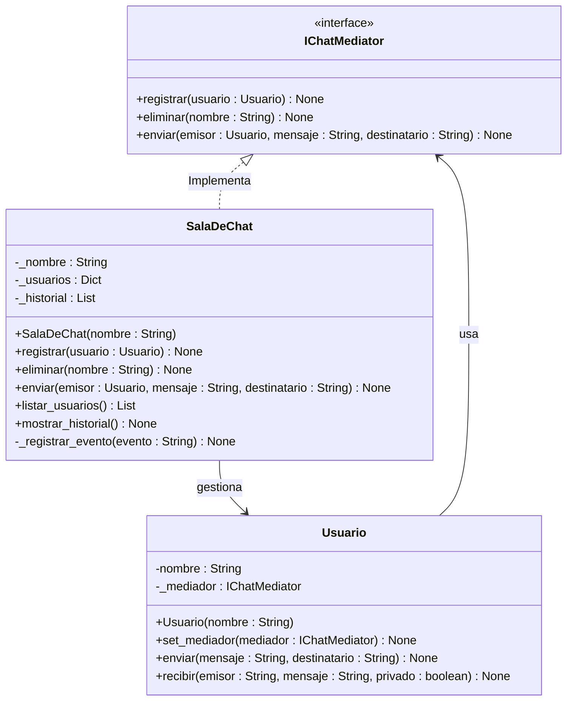

# Escenario 3 — Mediator

Aplicación de chat grupal donde los usuarios pueden enviarse mensajes entre sí dentro de una sala de chat.

### Típo de patrón: **Patrón de Comportamiento**

El escenario indica un problema enfocado en cómo interactuan los objetos (usuarios), distribuir responsabilidades y reducir dependencias entre componentes.
Se necesita controlar y centralizar las interacciones.

### Patrón a utilizar: **Mediator (Patrón Mediador)**

El patrón Mediator es ideal debido a que su propósito es reducir las dependencias directas entre objetos que se comunican, centralizando la interacción en un objeto mediador. Esto facilita el mantenimiento, mejora la modularidad y promueve un acoplamiento débil.

✅ Facil el mantenimiento El patrón Mediator permite que los usuarios no se comuniquen directamente entre sí, sino a través de la clase SalaChat, ya que, cada usuario únicamente conoce al mediador, reduciendo las dependencias entre objetos y facilitando el mantenimiento del sistema.

✅ Mejor organización Toda la lógica de comunicación se encuentra centralizada en el mediador (SalaChat), donde la clase se encarga de registrar usuarios,enviar mensajes, y controlar la interacción entre participantes. Esto centraliza las funcionalidades del codigo y los usuairos solo se dedican a enviar y recibir mensajes.

✅ Reduce la complejidad

No hay referencias directas entre usuarios, lo que elimina redes complejas en la cambinatoria de interacciones, permitiendo un crecimiento acelarado. Al pasar por un unico punto reduce el acomplemiento.

### Diagrama de clases:



### Ejecución del escenario:

```cmd
python -m ejercicio3_mediator.main
```

---

[← Volver al inicio](../README.md)
